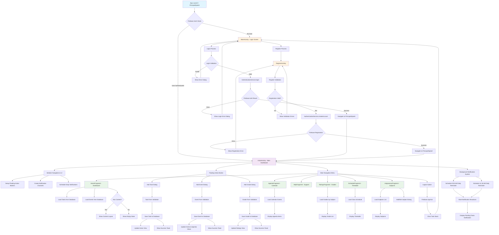

# EduPlanner - Diagrama de Actividades

## Descripción del Flujo de Actividades

### 1. **Inicio de Aplicación**
- **PrincipalSplash**: Pantalla de inicio que verifica el estado de autenticación
- **Firebase Auth Check**: Determina si el usuario está autenticado

### 2. **Flujo de Autenticación**
- **Login**: MainActivity con validación de campos y autenticación Firebase
- **Register**: RegisterActivity con validación de formulario y creación de cuenta
- **Error Handling**: Diálogos de error para fallos de autenticación

### 3. **Dashboard Principal (InicioActivity)**
- **Navigation Setup**: Configuración del menú lateral y navegación
- **Floating Action Buttons**: Botones flotantes para agregar contenido
- **Notification System**: Sistema de notificaciones programadas

### 4. **Fragmentos Principales**
- **HomeFragment**: Dashboard con tareas y eventos recientes
- **AgendaFragment**: Vista de calendario con eventos
- **RatingsFragment**: Gestión de calificaciones por asignatura
- **ScheduleFragment**: Horario de clases
- **AsignaturasFragment**: Gestión de materias
- **HelpFragment**: Ayuda y soporte

### 5. **Operaciones CRUD**
- **Tasks (Tareas)**: Crear, leer, actualizar tareas con prioridad
- **Events (Eventos)**: Gestión de eventos con fechas
- **Grades (Calificaciones)**: Sistema de notas por asignatura
- **Subjects (Asignaturas)**: Gestión de materias académicas

### 6. **Sistema de Notificaciones**
- **Daily Reminders**: Recordatorios automáticos a las 9:00 AM y 11:30 AM
- **Alarm Manager**: Gestión de alarmas persistentes
- **Notification Channels**: Canales de notificación personalizados

### 7. **Base de Datos (Room)**
- **Entities**: TareaEntity, EventoEntity, CalificacionEntity, AsignaturaEntity
- **DAOs**: Acceso a datos con operaciones CRUD
- **Repository Pattern**: Abstracción de acceso a datos

### 8. **Arquitectura MVVM**
- **ViewModels**: Lógica de negocio para cada fragmento
- **LiveData/StateFlow**: Observación reactiva de datos
- **Dependency Injection**: Hilt para inyección de dependencias

## Características Técnicas

- **Firebase Authentication**: Autenticación segura de usuarios
- **Room Database**: Persistencia local de datos (versión 9)
- **Navigation Component**: Navegación entre fragmentos
- **Material Design**: Interfaz de usuario moderna
- **Coroutines**: Programación asíncrona
- **Notifications**: Sistema de recordatorios automáticos