# Diagrama de Clases - EduPlanner

```mermaid
classDiagram
    %% Application Layer
    class MvvmEduPlannerApp {
        +onCreate()
    }
    
    %% Database Layer
    class TareasDatabase {
        +getTareasDao(): TareasDao
        +getEventosDao(): EventosDao
        +getAsignaturasDao(): AsignaturasDao
        +getCalificacionesDao(): CalificacionesDao
        +getPruebaDao(): PruebaDao
    }
    
    %% Entity Classes
    class TareaEntity {
        +Int? id
        +String titulo
        +String descrip
        +String asignatura
        +String fecha
        +Int prioridad
    }
    
    class EventoEntity {
        +Int? id
        +String titulo
        +String descrip
        +String fecha
        +Int prioridad
    }
    
    class AsignaturaEntity {
        +Int? id
        +String nombre
        +String tutor
        +Int duracion
        +Boolean lunes
        +Boolean martes
        +Boolean miercoles
        +Boolean jueves
        +Boolean viernes
        +Boolean sabado
        +Boolean domingo
    }
    
    class CalificacionEntity {
        +Int? id
        +String tipo
        +Float valor
        +String asignatura
        +String descripcion
    }
    
    %% DAO Interfaces
    class TareasDao {
        +getAllTareas(): List~TareaEntity~
        +deleteTarea(TareaEntity)
        +insertTarea(TareaEntity)
        +insertAll(List~TareaEntity~)
    }
    
    class EventosDao {
        +getAllEventos(): List~EventoEntity~
        +deleteEvento(EventoEntity)
        +insertEvento(EventoEntity)
    }
    
    class AsignaturasDao {
        +getAllAsignaturas(): List~AsignaturaEntity~
        +deleteAsignatura(AsignaturaEntity)
        +insertAsignatura(AsignaturaEntity)
    }
    
    class CalificacionesDao {
        +getAllCalificaciones(): List~CalificacionEntity~
        +deleteCalificacion(CalificacionEntity)
        +insertCalificacion(CalificacionEntity)
    }
    
    %% Repository Layer
    class TareasRepository {
        -TareasDao tareasDao
        +getTareas(): List~Tarea~
        +deleteTarea(Tarea)
        +insertTarea(Tarea)
    }
    
    class EventosRepository {
        -EventosDao eventosDao
        +getEventos(): List~Evento~
        +deleteEvento(Evento)
        +insertEvento(Evento)
    }
    
    class AsignaturasRepository {
        -AsignaturasDao asignaturasDao
        +getAsignaturas(): List~Asignatura~
        +deleteAsignatura(Asignatura)
        +insertAsignatura(Asignatura)
    }
    
    class CalificacionesRespository {
        -CalificacionesDao calificacionesDao
        +getCalificaciones(): List~Calificacion~
        +deleteCalificacion(Calificacion)
        +insertCalificacion(Calificacion)
    }
    
    %% Model Classes (UI Layer)
    class Tarea {
        +Int? id
        +String titulo
        +String descrip
        +String asignatura
        +String fecha
        +Int prioridad
    }
    
    class Evento {
        +Int? id
        +String titulo
        +String descrip
        +String fecha
        +Int prioridad
    }
    
    class Asignatura {
        +Int? id
        +String nombre
        +String tutor
        +Int duracion
        +Boolean lunes
        +Boolean martes
        +Boolean miercoles
        +Boolean jueves
        +Boolean viernes
        +Boolean sabado
        +Boolean domingo
    }
    
    class Calificacion {
        +Int? id
        +String tipo
        +Float valor
        +String asignatura
        +String descripcion
    }
    
    %% Use Cases
    class getTareasUseCase {
        -TareasRepository tareasRepository
        +invoke(): List~Tarea~
    }
    
    class getEventosUseCase {
        -EventosRepository eventosRepository
        +invoke(): List~Evento~
    }
    
    %% ViewModels
    class HomeViewModel {
        -getTareasUseCase getTareasUseCase
        -getEventosUseCase getEventosUseCase
        -TareasRepository tareasRepository
        -EventosRepository eventosRepository
        +MutableLiveData~List~Tarea~~ _tareas
        +MutableLiveData~List~Evento~~ _eventos
        +obtenerTareas()
        +obtenerEventos()
        +deleteTarea(Tarea)
        +deleteEvento(Evento)
    }
    
    class AsignaturasViewModel {
        -AsignaturasRepository asignaturasRepository
        +getAsignaturas()
        +insertAsignatura(Asignatura)
        +deleteAsignatura(Asignatura)
    }
    
    class CalificacionesViewModel {
        -CalificacionesRespository calificacionesRepository
        +getCalificaciones()
        +insertCalificacion(Calificacion)
        +deleteCalificacion(Calificacion)
    }
    
    class AgendaViewModel {
        -EventosRepository eventosRepository
        +getEventos()
        +insertEvento(Evento)
        +deleteEvento(Evento)
    }
    
    class HorarioViewModel {
        -AsignaturasRepository asignaturasRepository
        +getAsignaturas()
        +getHorarioData()
    }
    
    %% Fragment Classes
    class HomeFragment {
        -HomeViewModel homeViewModel
        -TareasAdapter tareasAdapter
        -EventosAdapter eventosAdapter
        +onViewCreated()
        +observeViewModel()
    }
    
    class AsignaturasFragment {
        -AsignaturasViewModel asignaturasViewModel
        -AsignaturasAdapter asignaturasAdapter
        +onViewCreated()
        +observeViewModel()
    }
    
    class RatingsFragment {
        -CalificacionesViewModel calificacionesViewModel
        -CalificacionesAdapter calificacionesAdapter
        +onViewCreated()
        +observeViewModel()
    }
    
    class AgendaFragment {
        -AgendaViewModel agendaViewModel
        -AgendaAdapter agendaAdapter
        +onViewCreated()
        +observeViewModel()
    }
    
    class ScheduleFragment {
        -HorarioViewModel horarioViewModel
        -HorarioAdapter horarioAdapter
        +onViewCreated()
        +observeViewModel()
    }
    
    %% Adapter Classes
    class TareasAdapter {
        -List~Tarea~ tareas
        +onCreateViewHolder()
        +onBindViewHolder()
        +getItemCount()
    }
    
    class EventosAdapter {
        -List~Evento~ eventos
        +onCreateViewHolder()
        +onBindViewHolder()
        +getItemCount()
    }
    
    class AsignaturasAdapter {
        -List~Asignatura~ asignaturas
        +onCreateViewHolder()
        +onBindViewHolder()
        +getItemCount()
    }
    
    class CalificacionesAdapter {
        -List~Calificacion~ calificaciones
        +onCreateViewHolder()
        +onBindViewHolder()
        +getItemCount()
    }
    
    %% DI Module
    class RoomModule {
        +provideRoom(Context): TareasDatabase
        +provideTareasDao(TareasDatabase): TareasDao
        +provideEventosDao(TareasDatabase): EventosDao
        +provideAsignaturasDao(TareasDatabase): AsignaturasDao
        +provideCalificacionesDao(TareasDatabase): CalificacionesDao
        +provideTareasRepository(TareasDao): TareasRepository
        +provideEventosRepository(EventosDao): EventosRepository
        +provideAsignaturasRepository(AsignaturasDao): AsignaturasRepository
        +provideCalificacionesRepository(CalificacionesDao): CalificacionesRespository
    }
    
    %% Authentication Layer
    class AuthenticationService {
        +login(String, String): LoginResponse
        +createAccount(String, String): Boolean
    }
    
    class FirebaseClient {
        +authenticate(String, String): Boolean
        +createUser(String, String): Boolean
    }
    
    class LoginUseCase {
        -AuthenticationService authService
        +invoke(UserLogin): LoginResponse
    }
    
    class CreateAccountUseCase {
        -AuthenticationService authService
        +invoke(UserRegister): Boolean
    }
    
    class UserLogin {
        +String email
        +String password
    }
    
    class UserRegister {
        +String email
        +String password
        +String confirmPassword
    }
    
    %% Main Activities
    class MainActivity {
        -Myviewmodel viewModel
        +onCreate()
        +navigateToHome()
    }
    
    class RegisterActivity {
        -viewmodelregister viewModel
        +onCreate()
        +register()
    }
    
    class InicioActivity {
        -InicioViewModel viewModel
        +onCreate()
        +setupNavigation()
    }
    
    %% Relationships
    MvvmEduPlannerApp --> RoomModule : uses DI
    
    TareasDatabase --> TareaEntity : contains
    TareasDatabase --> EventoEntity : contains
    TareasDatabase --> AsignaturaEntity : contains
    TareasDatabase --> CalificacionEntity : contains
    
    TareasDatabase --> TareasDao : provides
    TareasDatabase --> EventosDao : provides
    TareasDatabase --> AsignaturasDao : provides
    TareasDatabase --> CalificacionesDao : provides
    
    TareasDao --> TareaEntity : operates on
    EventosDao --> EventoEntity : operates on
    AsignaturasDao --> AsignaturaEntity : operates on
    CalificacionesDao --> CalificacionEntity : operates on
    
    TareasRepository --> TareasDao : uses
    EventosRepository --> EventosDao : uses
    AsignaturasRepository --> AsignaturasDao : uses
    CalificacionesRespository --> CalificacionesDao : uses
    
    TareasRepository --> Tarea : converts to/from
    EventosRepository --> Evento : converts to/from
    AsignaturasRepository --> Asignatura : converts to/from
    CalificacionesRespository --> Calificacion : converts to/from
    
    getTareasUseCase --> TareasRepository : uses
    getEventosUseCase --> EventosRepository : uses
    
    HomeViewModel --> getTareasUseCase : uses
    HomeViewModel --> getEventosUseCase : uses
    HomeViewModel --> TareasRepository : uses
    HomeViewModel --> EventosRepository : uses
    
    AsignaturasViewModel --> AsignaturasRepository : uses
    CalificacionesViewModel --> CalificacionesRespository : uses
    AgendaViewModel --> EventosRepository : uses
    HorarioViewModel --> AsignaturasRepository : uses
    
    HomeFragment --> HomeViewModel : uses
    HomeFragment --> TareasAdapter : uses
    HomeFragment --> EventosAdapter : uses
    
    AsignaturasFragment --> AsignaturasViewModel : uses
    AsignaturasFragment --> AsignaturasAdapter : uses
    
    RatingsFragment --> CalificacionesViewModel : uses
    RatingsFragment --> CalificacionesAdapter : uses
    
    AgendaFragment --> AgendaViewModel : uses
    AgendaFragment --> AgendaAdapter : uses
    
    ScheduleFragment --> HorarioViewModel : uses
    ScheduleFragment --> HorarioAdapter : uses
    
    LoginUseCase --> AuthenticationService : uses
    CreateAccountUseCase --> AuthenticationService : uses
    AuthenticationService --> FirebaseClient : uses
    
    MainActivity --> LoginUseCase : uses
    RegisterActivity --> CreateAccountUseCase : uses
    
    RoomModule --> TareasDatabase : provides
    RoomModule --> TareasRepository : provides
    RoomModule --> EventosRepository : provides
    RoomModule --> AsignaturasRepository : provides
    RoomModule --> CalificacionesRespository : provides
```

## Descripción del Diagrama

### Arquitectura MVVM
El diagrama muestra la implementación de la arquitectura MVVM (Model-View-ViewModel) con las siguientes capas:

1. **Application Layer**: `MvvmEduPlannerApp` como punto de entrada principal
2. **View Layer**: Fragments que representan la interfaz de usuario
3. **ViewModel Layer**: ViewModels que manejan la lógica de presentación
4. **Model Layer**: Entidades, repositorios y casos de uso
5. **Database Layer**: Room database con DAOs y entidades

### Inyección de Dependencias
- `RoomModule` configura todas las dependencias usando Dagger Hilt
- Proporciona instancias singleton de la base de datos, DAOs y repositorios

### Patrones de Diseño Implementados
- **Repository Pattern**: Abstrae el acceso a datos
- **Use Case Pattern**: Encapsula la lógica de negocio
- **Adapter Pattern**: Para RecyclerViews
- **MVVM Pattern**: Separación de responsabilidades
- **Dependency Injection**: Gestión automática de dependencias

### Entidades Principales
- **TareaEntity/Tarea**: Gestión de tareas académicas
- **EventoEntity/Evento**: Gestión de eventos y calendario
- **AsignaturaEntity/Asignatura**: Gestión de asignaturas y horarios
- **CalificacionEntity/Calificacion**: Gestión de calificaciones

### Navegación
El app utiliza Navigation Component con 6 fragments principales:
- HomeFragment (tareas y eventos)
- AgendaFragment (calendario)
- RatingsFragment (calificaciones)
- ScheduleFragment (horario)
- AsignaturasFragment (asignaturas)
- HelpFragment (ayuda)