# EduPlanner - Mapa de Navegación

```mermaid
graph TD
    subgraph "App Entry Points"
        START[App Launch]
        START --> SPLASH[PrincipalSplash Activity]
    end
    
    subgraph "Authentication Flow"
        SPLASH --> AUTH_CHECK{Firebase Auth Check}
        AUTH_CHECK -->|No User| LOGIN[MainActivity - Login]
        AUTH_CHECK -->|User Authenticated| MAIN[InicioActivity - Dashboard]
        
        LOGIN --> LOGIN_FORM[Login Form]
        LOGIN_FORM --> LOGIN_SUBMIT{Login Validation}
        LOGIN_SUBMIT -->|Valid| LOGIN_AUTH[Firebase Authentication]
        LOGIN_SUBMIT -->|Invalid| LOGIN_ERROR[Show Login Error]
        LOGIN_ERROR --> LOGIN_FORM
        
        LOGIN_AUTH -->|Success| LOGIN_SUCCESS[Navigate to Splash]
        LOGIN_AUTH -->|Error| LOGIN_AUTH_ERROR[Show Auth Error Dialog]
        LOGIN_AUTH_ERROR --> LOGIN_FORM
        
        LOGIN --> REG_LINK[Register Link]
        REG_LINK --> REGISTER[RegisterActivity]
        
        REGISTER --> REG_FORM[Registration Form]
        REG_FORM --> REG_SUBMIT{Registration Validation}
        REG_SUBMIT -->|Valid| REG_AUTH[Firebase Create Account]
        REG_SUBMIT -->|Invalid| REG_ERROR[Show Validation Errors]
        REG_ERROR --> REG_FORM
        
        REG_AUTH -->|Success| REG_SUCCESS[Navigate to Splash]
        REG_AUTH -->|Error| REG_AUTH_ERROR[Show Registration Error]
        REG_AUTH_ERROR --> REG_FORM
        
        REGISTER --> LOGIN_LINK[Login Link]
        LOGIN_LINK --> LOGIN
        
        LOGIN_SUCCESS --> SPLASH
        REG_SUCCESS --> SPLASH
    end
    
    subgraph "Main Navigation (InicioActivity)"
        MAIN --> NAV_SETUP[Initialize Navigation]
        NAV_SETUP --> NAV_GRAPH[Navigation Graph Setup]
        NAV_GRAPH --> HOME_START[Start Destination: HomeFragment]
        
        MAIN --> DRAWER[Navigation Drawer Menu]
        MAIN --> FAB_MENU[Floating Action Buttons]
        MAIN --> TOOLBAR[Toolbar with Back Navigation]
        
        subgraph "Navigation Drawer Options"
            DRAWER --> HOME_MENU[🏠 Home]
            DRAWER --> AGENDA_MENU[📅 Agenda]
            DRAWER --> RATINGS_MENU[📊 Calificaciones]
            DRAWER --> SUBJECTS_MENU[📚 Asignaturas]
            DRAWER --> SCHEDULE_MENU[🗓️ Horario]
            DRAWER --> HELP_MENU[❓ Ayuda y opiniones]
            DRAWER --> LOGOUT_MENU[🚪 Cerrar sesión]
        end
        
        subgraph "Fragment Navigation"
            HOME_MENU --> HOME_FRAG[HomeFragment - id_home_fragment]
            AGENDA_MENU --> AGENDA_FRAG[AgendaFragment - id_diary_fragment]
            RATINGS_MENU --> RATINGS_FRAG[RatingsFragment - id_ratings_fragment]
            SUBJECTS_MENU --> SUBJECTS_FRAG[AsignaturasFragment - id_subjects_fragment]
            SCHEDULE_MENU --> SCHEDULE_FRAG[ScheduleFragment - id_schedule_fragment]
            HELP_MENU --> HELP_FRAG[HelpFragment - id_help_fragment]
        end
        
        subgraph "Fragment Features & Actions"
            HOME_FRAG --> HOME_TASKS[Display Tasks List]
            HOME_FRAG --> HOME_EVENTS[Display Events List]
            HOME_FRAG --> HOME_EMPTY[Empty State View]
            HOME_FRAG --> HOME_HAMBURGER[Hamburger Menu Toggle]
            
            AGENDA_FRAG --> AGENDA_CALENDAR[Calendar View]
            AGENDA_FRAG --> AGENDA_ITEMS[Agenda Items List]
            
            RATINGS_FRAG --> RATINGS_LIST[Grades by Subject]
            RATINGS_FRAG --> RATINGS_STATS[Grade Statistics]
            
            SUBJECTS_FRAG --> SUBJECTS_LIST[Subjects Management]
            SUBJECTS_FRAG --> SUBJECTS_ADD[Add/Edit Subject]
            
            SCHEDULE_FRAG --> SCHEDULE_VIEW[Class Timetable]
            SCHEDULE_FRAG --> SCHEDULE_CALENDAR[Calendar Integration]
            
            HELP_FRAG --> HELP_CONTENT[Help & Support Content]
        end
        
        subgraph "Floating Action Button Menu"
            FAB_MENU --> FAB_MAIN[Main FAB Button]
            FAB_MAIN --> FAB_TASK[📝 Add Task]
            FAB_MAIN --> FAB_EVENT[📅 Add Event]
            FAB_MAIN --> FAB_GRADE[📊 Add Grade]
            
            FAB_TASK --> TASK_DIALOG[Task Creation Dialog]
            FAB_EVENT --> EVENT_DIALOG[Event Creation Dialog]
            FAB_GRADE --> GRADE_DIALOG[Grade Creation Dialog]
            
            TASK_DIALOG --> TASK_FORM[Task Form with Subject Selection]
            TASK_FORM --> TASK_SAVE[Save Task to Database]
            TASK_SAVE --> TASK_SUCCESS[Show Success Toast]
            TASK_SUCCESS --> HOME_FRAG
            
            EVENT_DIALOG --> EVENT_FORM[Event Form with Date Selection]
            EVENT_FORM --> EVENT_SAVE[Save Event to Database]
            EVENT_SAVE --> EVENT_SUCCESS[Show Success Toast]
            EVENT_SUCCESS --> HOME_FRAG
            
            GRADE_DIALOG --> GRADE_FORM[Grade Form with Subject Selection]
            GRADE_FORM --> GRADE_SAVE[Save Grade to Database]
            GRADE_SAVE --> GRADE_SUCCESS[Show Success Toast]
            GRADE_SUCCESS --> RATINGS_FRAG
        end
        
        LOGOUT_MENU --> LOGOUT_ACTION[Firebase SignOut]
        LOGOUT_ACTION --> LOGOUT_REDIRECT[Clear Task Stack]
        LOGOUT_REDIRECT --> LOGIN
    end
    
    subgraph "Background Navigation"
        MAIN --> NOTIFICATION_SETUP[Setup Notification Channels]
        NOTIFICATION_SETUP --> ALARM_SCHEDULE[Schedule Daily Alarms]
        ALARM_SCHEDULE --> ALARM_MORNING[9:00 AM Notification]
        ALARM_SCHEDULE --> ALARM_AFTERNOON[11:30 AM Notification]
        
        ALARM_MORNING --> NOTIFICATION[Pending Tasks Notification]
        ALARM_AFTERNOON --> NOTIFICATION
        NOTIFICATION --> NOTIFICATION_CLICK[User Clicks Notification]
        NOTIFICATION_CLICK --> MAIN
    end
    
    subgraph "Data Navigation Flow"
        HOME_FRAG --> LOAD_TASKS[Load Tasks from Repository]
        HOME_FRAG --> LOAD_EVENTS[Load Events from Repository]
        AGENDA_FRAG --> LOAD_AGENDA[Load Agenda Items]
        RATINGS_FRAG --> LOAD_GRADES[Load Grades by Subject]
        SUBJECTS_FRAG --> LOAD_SUBJECTS[Load Subjects List]
        SCHEDULE_FRAG --> LOAD_SCHEDULE[Load Class Schedule]
        
        LOAD_TASKS --> UPDATE_HOME[Update Home View]
        LOAD_EVENTS --> UPDATE_HOME
        LOAD_AGENDA --> UPDATE_AGENDA[Update Agenda View]
        LOAD_GRADES --> UPDATE_RATINGS[Update Ratings View]
        LOAD_SUBJECTS --> UPDATE_SUBJECTS[Update Subjects View]
        LOAD_SCHEDULE --> UPDATE_SCHEDULE[Update Schedule View]
    end
    
    subgraph "Navigation States & Transitions"
        NAV_GRAPH --> NAV_CONTROLLER[NavController Management]
        NAV_CONTROLLER --> NAV_UP[Up Navigation Support]
        NAV_CONTROLLER --> NAV_DRAWER[Drawer Navigation]
        NAV_CONTROLLER --> NAV_MENU[Menu Item Navigation]
        
        NAV_UP --> BACK_STACK[Back Stack Management]
        BACK_STACK --> NAV_BACK[Navigate Back]
        NAV_BACK --> PREVIOUS_FRAGMENT[Previous Fragment State]
    end
    
    %% Styling
    classDef authFlow fill:#ffebee
    classDef mainNav fill:#e8f5e8
    classDef fragments fill:#e3f2fd
    classDef dialogs fill:#fff3e0
    classDef actions fill:#f3e5f5
    classDef data fill:#f1f8e9
    classDef notifications fill:#fce4ec
    
    class SPLASH,LOGIN,REGISTER,LOGIN_FORM,REG_FORM,LOGIN_AUTH,REG_AUTH authFlow
    class MAIN,NAV_SETUP,NAV_GRAPH,DRAWER,FAB_MENU,TOOLBAR mainNav
    class HOME_FRAG,AGENDA_FRAG,RATINGS_FRAG,SUBJECTS_FRAG,SCHEDULE_FRAG,HELP_FRAG fragments
    class TASK_DIALOG,EVENT_DIALOG,GRADE_DIALOG,TASK_FORM,EVENT_FORM,GRADE_FORM dialogs
    class TASK_SAVE,EVENT_SAVE,GRADE_SAVE,LOGOUT_ACTION actions
    class LOAD_TASKS,LOAD_EVENTS,LOAD_AGENDA,LOAD_GRADES,LOAD_SUBJECTS,LOAD_SCHEDULE data
    class NOTIFICATION_SETUP,ALARM_SCHEDULE,NOTIFICATION notifications
```

## Descripción del Mapa de Navegación

### **1. Flujo de Autenticación**
- **Entry Point**: PrincipalSplash verifica el estado de Firebase Auth
- **Login Flow**: MainActivity → Validación → Firebase Auth → Dashboard
- **Register Flow**: RegisterActivity → Validación → Firebase Create Account → Dashboard
- **Cross Navigation**: Links bidireccionales entre Login y Register

### **2. Navegación Principal (InicioActivity)**
- **Navigation Graph**: Configuración con 6 fragmentos principales
- **Start Destination**: HomeFragment como pantalla inicial
- **Navigation Drawer**: Menú lateral con 6 opciones + logout
- **Toolbar**: Soporte para navegación hacia atrás

### **3. Fragmentos y Características**
#### **HomeFragment** (`id_home_fragment`) 🏠
- Dashboard principal con tareas y eventos
- Estados: Contenido vs. Vista vacía
- Hamburger menu toggle

#### **AgendaFragment** (`id_diary_fragment`) 📅
- Vista de calendario con eventos
- Lista de elementos de agenda

#### **RatingsFragment** (`id_ratings_fragment`) 📊
- Gestión de calificaciones por asignatura
- Estadísticas de notas

#### **AsignaturasFragment** (`id_subjects_fragment`) 📚
- Administración de materias
- Agregar/Editar asignaturas

#### **ScheduleFragment** (`id_schedule_fragment`) 🗓️
- Horario de clases
- Integración con calendario

#### **HelpFragment** (`id_help_fragment`) ❓
- Contenido de ayuda y soporte

### **4. Floating Action Buttons**
- **FAB Principal**: Botón central que expande opciones
- **Tres Opciones**:
  - 📝 **Add Task**: Diálogo de creación de tareas
  - 📅 **Add Event**: Diálogo de creación de eventos  
  - 📊 **Add Grade**: Diálogo de creación de calificaciones
- **Post-Creation**: Navegación automática a fragmento relevante

### **5. Navegación de Datos**
- **Repository Pattern**: Carga de datos desde repositorios
- **Live Updates**: Actualización reactiva de vistas
- **Cross-Fragment Updates**: Sincronización entre fragmentos

### **6. Sistema de Notificaciones**
- **Background Navigation**: Configuración de canales y alarmas
- **Daily Reminders**: 9:00 AM y 11:30 AM
- **Notification Click**: Navegación de vuelta a la app

### **7. Gestión de Estados**
- **NavController**: Control centralizado de navegación
- **Back Stack**: Manejo de pila de navegación
- **Up Navigation**: Soporte para navegación hacia atrás
- **Drawer Toggle**: Sincronización con menú lateral

### **8. Puntos de Salida**
- **Logout**: Firebase SignOut → Clear Task Stack → Login
- **Session Management**: Manejo de sesiones de usuario

### **Características Técnicas de Navegación**
- **Navigation Component**: Framework moderno de Android
- **Single Activity**: Patrón de una actividad principal
- **Fragment Transactions**: Transiciones fluidas entre pantallas
- **Deep Linking**: Soporte para navegación directa
- **State Management**: Preservación de estado entre navegaciones