# EduPlanner - Diagrama de Paquetes

```mermaid
graph TD
    subgraph "com.softcg.myapplication"
        
        subgraph "App Layer"
            APP[MvvmEduPlannerApp]
            SPLASH[PrincipalSplash]
        end
        
        subgraph "UI Layer"
            subgraph "ui.login"
                LOGIN_ACT[MainActivity]
                LOGIN_VM[Myviewmodel]
                LOGIN_STATE[LoginViewState]
                LOGIN_MODEL[model.UserLogin]
            end
            
            subgraph "ui.register"
                REG_ACT[RegisterActivity]
                REG_VM[viewmodelregister]
                REG_STATE[RegisterViewState]
                REG_MODEL[model.UserRegister]
            end
            
            subgraph "ui.Inicio"
                INICIO_ACT[InicioActivity]
                INICIO_VM[InicioViewModel]
                INICIO_MODELS[Models.Tarea/Evento]
                
                subgraph "Fragments.Home"
                    HOME_FRAG[HomeFragment]
                    HOME_VM[HomeViewModel]
                    HOME_ADAPTERS[Adapters.TareasAdapter/EventosAdapter]
                end
                
                subgraph "Fragments.Agenda"
                    AGENDA_FRAG[AgendaFragment]
                    AGENDA_VM[AgendaViewModel]
                    AGENDA_ADAPTER[Adapters.AgendaAdapter]
                    AGENDA_MODEL[Models.AgendaItem]
                end
                
                subgraph "Fragments.Calificaciones"
                    CAL_FRAG[RatingsFragment]
                    CAL_VM[CalificacionesViewModel]
                    CAL_ADAPTER[Adapters.CalificacionesAdapter]
                    CAL_MODEL[Models.Calificacion]
                end
                
                subgraph "Fragments.Asignaturas"
                    ASIG_FRAG[AsignaturasFragment]
                    ASIG_VM[AsignaturasViewModel]
                    ASIG_ADAPTER[Adapters.AsignaturasAdapter]
                    ASIG_MODEL[Models.Asignatura]
                end
                
                subgraph "Fragments.Horario"
                    HOR_FRAG[ScheduleFragment]
                    HOR_VM[HorarioViewModel]
                    HOR_ADAPTER[Adapters.HorarioAdapter/CalendarAdapter]
                end
                
                subgraph "Fragments.Ayuda"
                    HELP_FRAG[HelpFragment]
                end
            end
            
            subgraph "ui.notifications"
                ALARM[AlarmNotification]
            end
        end
        
        subgraph "Domain Layer"
            LOGIN_UC[LoginUseCase]
            CREATE_UC[CreateAccountUseCase]
            TAREAS_UC[getTareasUseCase]
        end
        
        subgraph "Data Layer"
            subgraph "data.network"
                AUTH_SERVICE[AuthenticationService]
                FIREBASE_CLIENT[FirebaseClient]
                LOGIN_RESPONSE[response.LoginResponse]
            end
            
            subgraph "data.Repositories"
                TAREAS_REPO[TareasRepository]
                EVENTOS_REPO[EventosRepository]
                ASIG_REPO[AsignaturasRepository]
                CAL_REPO[CalificacionesRespository]
                PRUEBA_REPO[pruebaRepository]
            end
            
            subgraph "data.database"
                subgraph "TareasDatabase"
                    DATABASE[TareasDatabase]
                end
                
                subgraph "entities"
                    TAREA_ENT[TareaEntity]
                    EVENTO_ENT[EventoEntity]
                    ASIG_ENT[AsignaturaEntity]
                    CAL_ENT[CalificacionEntity]
                end
                
                subgraph "dao"
                    TAREAS_DAO[TareasDao]
                    EVENTOS_DAO[EventosDao]
                    ASIG_DAO[AsignaturasDao]
                    CAL_DAO[CalificacionesDao]
                    PRUEBA_DAO[PruebaDao]
                end
            end
        end
        
        subgraph "Dependency Injection"
            DI_MODULE[di.RoomModule]
        end
        
        subgraph "Core Utilities"
            subgraph "core.dialog"
                ERROR_DIALOG[ErrorDialog]
                DIALOG_LAUNCHER[DialogFragmentLauncher]
                TIME_PICKER[TimePickerFragment]
            end
            
            subgraph "core.ex"
                VIEW_EX[ViewEx]
                EDIT_EX[EditTextEx]
                DIALOG_EX[DialogEx]
            end
            
            subgraph "core.delegate"
                WEAK_REF[WeakReferenceDelegate]
            end
            
            subgraph "core.utils"
                CALENDAR_UTILS[CalendarUtils]
            end
            
            CORE_EVENT[core.Event]
        end
    end
    
    subgraph "External Dependencies"
        FIREBASE[Firebase Auth/Analytics]
        ROOM[Room Database]
        HILT[Dagger Hilt]
        ANDROID[Android Framework]
        MATERIAL[Material Design]
        NAVIGATION[Navigation Component]
    end

    %% Dependencies - UI Layer
    LOGIN_VM --> LOGIN_UC
    LOGIN_VM --> AUTH_SERVICE
    REG_VM --> CREATE_UC
    REG_VM --> AUTH_SERVICE
    
    HOME_VM --> TAREAS_REPO
    HOME_VM --> EVENTOS_REPO
    AGENDA_VM --> EVENTOS_REPO
    CAL_VM --> CAL_REPO
    ASIG_VM --> ASIG_REPO
    
    INICIO_VM --> TAREAS_REPO
    INICIO_VM --> EVENTOS_REPO
    INICIO_VM --> ASIG_REPO
    INICIO_VM --> CAL_REPO
    
    %% Dependencies - Domain Layer
    LOGIN_UC --> AUTH_SERVICE
    CREATE_UC --> AUTH_SERVICE
    TAREAS_UC --> TAREAS_REPO
    
    %% Dependencies - Data Layer
    AUTH_SERVICE --> FIREBASE_CLIENT
    FIREBASE_CLIENT --> FIREBASE
    
    TAREAS_REPO --> TAREAS_DAO
    EVENTOS_REPO --> EVENTOS_DAO
    ASIG_REPO --> ASIG_DAO
    CAL_REPO --> CAL_DAO
    
    TAREAS_DAO --> DATABASE
    EVENTOS_DAO --> DATABASE
    ASIG_DAO --> DATABASE
    CAL_DAO --> DATABASE
    
    DATABASE --> TAREA_ENT
    DATABASE --> EVENTO_ENT
    DATABASE --> ASIG_ENT
    DATABASE --> CAL_ENT
    DATABASE --> ROOM
    
    %% Dependencies - DI
    DI_MODULE --> DATABASE
    DI_MODULE --> TAREAS_REPO
    DI_MODULE --> EVENTOS_REPO
    DI_MODULE --> ASIG_REPO
    DI_MODULE --> CAL_REPO
    DI_MODULE --> HILT
    
    %% App Dependencies
    APP --> HILT
    APP --> FIREBASE
    SPLASH --> FIREBASE
    
    %% UI Framework Dependencies
    LOGIN_ACT --> ANDROID
    REG_ACT --> ANDROID
    INICIO_ACT --> ANDROID
    HOME_FRAG --> ANDROID
    AGENDA_FRAG --> ANDROID
    CAL_FRAG --> ANDROID
    ASIG_FRAG --> ANDROID
    HOR_FRAG --> ANDROID
    HELP_FRAG --> ANDROID
    
    INICIO_ACT --> NAVIGATION
    INICIO_ACT --> MATERIAL
    
    %% Core Utilities Dependencies
    ERROR_DIALOG --> ANDROID
    DIALOG_LAUNCHER --> ANDROID
    TIME_PICKER --> ANDROID
    
    %% Styling
    classDef appLayer fill:#e3f2fd
    classDef uiLayer fill:#f3e5f5
    classDef domainLayer fill:#e8f5e8
    classDef dataLayer fill:#fff3e0
    classDef diLayer fill:#ffebee
    classDef coreLayer fill:#f1f8e9
    classDef externalLayer fill:#fafafa
    
    class APP,SPLASH appLayer
    class LOGIN_ACT,LOGIN_VM,REG_ACT,REG_VM,INICIO_ACT,INICIO_VM,HOME_FRAG,HOME_VM,AGENDA_FRAG,AGENDA_VM,CAL_FRAG,CAL_VM,ASIG_FRAG,ASIG_VM,HOR_FRAG,HOR_VM,HELP_FRAG,ALARM uiLayer
    class LOGIN_UC,CREATE_UC,TAREAS_UC domainLayer
    class AUTH_SERVICE,FIREBASE_CLIENT,TAREAS_REPO,EVENTOS_REPO,ASIG_REPO,CAL_REPO,DATABASE,TAREA_ENT,EVENTO_ENT,ASIG_ENT,CAL_ENT,TAREAS_DAO,EVENTOS_DAO,ASIG_DAO,CAL_DAO dataLayer
    class DI_MODULE diLayer
    class ERROR_DIALOG,DIALOG_LAUNCHER,TIME_PICKER,VIEW_EX,EDIT_EX,DIALOG_EX,WEAK_REF,CALENDAR_UTILS,CORE_EVENT coreLayer
    class FIREBASE,ROOM,HILT,ANDROID,MATERIAL,NAVIGATION externalLayer
```

## Descripción del Diagrama de Paquetes

### **Arquitectura en Capas**

#### **1. App Layer** 
- **MvvmEduPlannerApp**: Clase principal de aplicación con Hilt
- **PrincipalSplash**: Splash screen con verificación de autenticación

#### **2. UI Layer (Presentation)**
- **ui.login**: Autenticación de usuarios (MainActivity, ViewModels, States)
- **ui.register**: Registro de nuevos usuarios
- **ui.Inicio**: Dashboard principal con navegación entre fragmentos
  - **Fragments.Home**: Dashboard con tareas y eventos
  - **Fragments.Agenda**: Vista de calendario
  - **Fragments.Calificaciones**: Gestión de notas
  - **Fragments.Asignaturas**: Administración de materias
  - **Fragments.Horario**: Horario de clases
  - **Fragments.Ayuda**: Soporte y ayuda
- **ui.notifications**: Sistema de notificaciones

#### **3. Domain Layer (Business Logic)**
- **Use Cases**: LoginUseCase, CreateAccountUseCase, getTareasUseCase
- Contiene la lógica de negocio pura

#### **4. Data Layer**
- **data.network**: Servicios de red y Firebase
- **data.Repositories**: Patrón Repository para acceso a datos
- **data.database**: Persistencia local con Room
  - **entities**: Entidades de base de datos
  - **dao**: Data Access Objects
  - **TareasDatabase**: Configuración de base de datos

#### **5. Dependency Injection**
- **di.RoomModule**: Configuración de Hilt para inyección de dependencias

#### **6. Core Utilities**
- **core.dialog**: Diálogos personalizados
- **core.ex**: Extensiones de Kotlin
- **core.delegate**: Delegados personalizados
- **core.utils**: Utilidades generales

### **Dependencias Externas**
- **Firebase**: Autenticación y Analytics
- **Room**: Base de datos local
- **Dagger Hilt**: Inyección de dependencias  
- **Android Framework**: Componentes base
- **Material Design**: UI Components
- **Navigation Component**: Navegación entre pantallas

### **Patrones Arquitectónicos**
- **MVVM**: Model-View-ViewModel
- **Repository Pattern**: Abstracción de acceso a datos
- **Use Cases**: Lógica de negocio encapsulada
- **Dependency Injection**: Inversión de control con Hilt

### **Flujo de Dependencias**
1. **UI → Domain → Data**: Flujo principal de dependencias
2. **DI Module**: Proporciona instancias de repositorios y base de datos
3. **Core Utilities**: Utilities compartidas entre capas
4. **External Libraries**: Frameworks y librerías externas